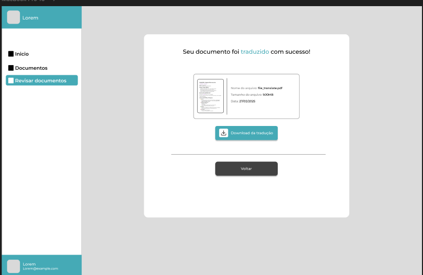
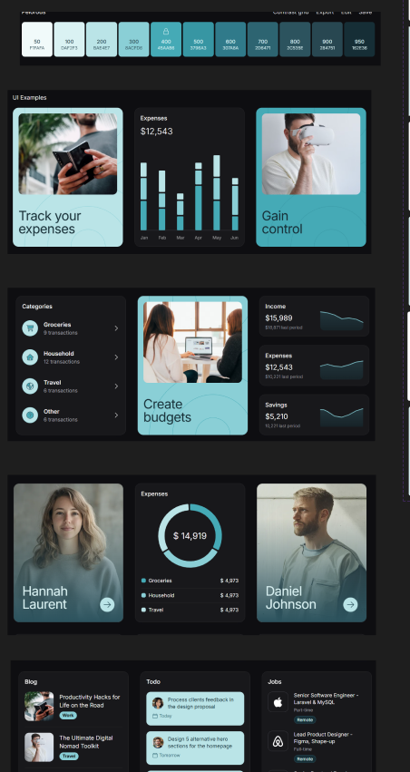

# Final Report — Modulo 1

**Project:** Intelligent Translation of Clinical Documents with AI
**Student:** Abner Silva Barbosa  

**Track: Entrepreneurship | Module 1 — 2025**

---

## Introduction

This report presents a detailed summary of the activities developed throughout the first module in the Entrepreneurship track. Our goal was to initiate the development of an innovative solution that uses advanced Artificial Intelligence to translate clinical and pharmaceutical technical documents, maintaining specialized terminology, original formatting, and precision necessary for the regulatory and research context. The solution aims not only to translate text but to preserve complex elements such as tables, graphs, and images with captions, ensuring the integrity of technical documents.

---

## Project Overview

### Identified Problem

We identified a significant gap in the market for translation of technical documents in the pharmaceutical and clinical research area. Currently, organizations face three critical challenges:

1. **Errors in manual translations**: Translators without specialized knowledge often compromise the integrity of technical information, potentially leading to incorrect interpretations that negatively impact research and regulatory processes.
2. **Delays in the translation process**: Critical documents (ranging from 15 to 300 pages) can take weeks to be translated manually, causing significant delays in regulatory and operational deadlines.
3. **Confidentiality risk**: Sending sensitive documents to external translators or services without adequate protection compromises the security of patient data and intellectual property.

### Proposed Solution

Our solution integrates cutting-edge technologies to create a comprehensive specialized translation platform:

- **Specialized AI system**: We developed an artificial intelligence model specifically trained for medical and pharmaceutical terminology, capable of maintaining technical precision.
- **Intelligent document processing**: We implemented advanced PDF and DOC handling that preserves the original formatting, including tables, graphs, and images with captions.
- **Collaborative interface**: We created an intuitive platform that allows real-time review, editing, and feedback, accelerating the translation cycle and continuous improvement of the model.
- **Security and compliance**: We implemented robust security protocols, encryption, and compliance with regulatory standards (LGPD/GDPR) to ensure data confidentiality.

Slide link: https://www.figma.com/slides/dxg5YcOpeCniFsJ4cZF8Ho/Untitled?node-id=1-44&t=nKgpJapWAQfDfLyX-1

---

## Deliverables

### 📁 Planning and Market Research (Sprint 1)

- **Complete TAPI document**: We prepared a detailed analysis of the problem, solution, potential market, and business model, identifying an initial target market of medium-sized clinics and pharmaceutical companies.
- **Detailed project structure**: We developed a comprehensive schedule divided into 4 annual modules, with clear development milestones, market validation, and scalability.
- **In-depth market research**: We conducted interviews with 8 industry professionals (3 clinical research managers, 2 technical translation specialists, 3 regulatory coordinators) to validate the pain points and specific needs.
- **Regulatory analysis**: We mapped compliance requirements for technical translations in clinical environments, including requirements from ANVISA and international bodies.
- **Detailed user stories**: We created 10 complete user stories with specific and measurable acceptance criteria, prioritized based on customer needs.
- **Initial wireframes**: We developed the first interface sketches in Figma, focusing on the document upload, translation, and review flow.
- **GitHub structure**: We organized the repository with a clear structure for documentation, code, research, and wireframes.

### 🧠 Research and Technical Development (Sprints 2–4)

- **In-depth study of translation metrics**: We analyzed various metrics (BLEU, COMET, TER, METEOR) to define the quality parameters of the system, documenting advantages and limitations of each for our specific context.
- **Development of PDF manipulation scripts**: We created multiple versions of the main PDF manipulation script, using libraries such as PyMuPDF to preserve the original formatting, fonts, and exact text positioning when performing translations.
- **High-fidelity wireframes**: We evolved the initial wireframes into interactive prototypes in Figma, incorporating feedback from potential users and focusing on accessibility and workflow efficiency.
- **Detailed technical architecture**: We defined a microservices-based architecture with a single-tenant model to ensure isolation of each client's data, detailing:
    - Authentication and authorization system based on OAuth 2.0
    - Document processing service with asynchronous queues
    - AI service for translation with continuous learning capability
    - Secure storage service with encryption at rest
    - Collaborative review system with version control
- **AI integration strategies**: We researched and documented approaches for integration with AI frameworks, including:
    - Comparative analysis of specialized language models (BERT, Transformer, GPT)
    - Fine-tuning techniques for medical and pharmaceutical terminology
    - Quality validation strategies and feedback methods for continuous learning
    - Computational cost estimates and resource optimization
- **Initial translation experiments**: We conducted preliminary tests combining existing models (T5, MarianMT) with public datasets of medical terminology, evaluating the results with BLEU metrics.

### 🛠️ Sprint 5 — Final Deliverables

- **Complete UI/UX**: We finalized high-fidelity wireframes for all main system screens, including:
    - Personalized dashboard with usage and quality metrics
    - Upload interface with support for multiple formats (PDF, DOCX, PPTX)
    - Workspace for side-by-side viewing (original/translation)
    - Review interface with change history
    - Administrative panel for user and permission management
- **Architecture document**: We prepared detailed technical documentation of the proposed architecture, including:
    - Data flow and sequence diagrams
    - Internal and external API specifications
    - Infrastructure and scalability requirements
    - Security and data protection strategies
    - Implementation and migration plan
- **Functional proof of concept**: We implemented a functional PDF manipulation prototype with the capability to:
    - Exactly preserve the formatting, font, and positioning of the original text
    - Identify and manipulate tables, graphs, and images with captions
    - Replace text while maintaining the visual characteristics of the document
    - Process documents with complex structure without loss of formatting
- **Structured repository**: We organized GitHub with clear sections for:
    - Technical and business documentation
    - Source code with detailed comments
    - Test and validation datasets
    - Experiment results
    - Wireframes and design assets
- **Detailed technical roadmap**: We prepared a technical development plan for the next 6 months, including:
    - Feature prioritization
    - Effort and resource estimates
    - Delivery milestones
    - Validation methodology

---

## Learnings

- **Artificial Intelligence for specialized translation**: We deepened our knowledge of Transformer architectures for technical translation, including fine-tuning strategies and quality validation specific to medical terminology.
- **Advanced translation quality metrics**: We developed expertise in the application and interpretation of evaluation metrics (BLEU, COMET), focusing on adaptations for the technical-scientific context.
- **Microservices architecture for document processing**: We acquired practical knowledge about designing resilient and secure systems for processing sensitive documents at scale.
- **PDF engineering**: We built specialized competency in the programmatic manipulation of complex PDF documents, maintaining visual and structural fidelity.
- **User-centered design for technical workflows**: We applied UX principles to create efficient interfaces for technical users, balancing simplicity with advanced features.
- **Security and compliance in healthcare applications**: We assimilated security requirements and practices specific to the healthcare and clinical research sector.
- **Parallel technical and market validation**: We developed a methodology to quickly iterate between technical validation and market feedback.

Some references in portugues:
[Transformer](./documents/artigos/Transformer%20Arch.md)
[BLEU](./documents/artigos/BLEU.md)
[COMET](./documents/artigos/COMET.md)

---

## Figma (Wireframe)

Below you can view the screens that were developed for the MVP following the palettes and font chosen by the development team (Abner).

Figma link: https://www.figma.com/design/MdSVYRn5XXv3gqcvUD9JWA/TCI?node-id=1-2&t=QOnlUktrpr2GLU4D-1

## Project Architecture

### Architecture Components

1. **Clinic A / Domain A**: The entry point where the user (clinic professional) accesses the system through a specific domain.
2. **NO-A Container - v1.8.8 Front End**: User interface that allows document upload, translation viewing, and interaction with the system.
3. **Authentication**: Central security component that manages access to the system, ensuring that only authorized users can access resources.
4. **NO-A Container - v1.1.8 Websocket**: Responsible for real-time communication between client and server, allowing instant updates on translation progress.
5. **MinIO / S3 Storage**: Object storage system compatible with Amazon S3, used to securely store original documents and their translations with encryption.
6. **NO-A Container - v1.1.8 Document Processing**: Service that prepares documents for translation, extracts text, and maintains the original formatting.
7. **NO-A Container - v2.0.0 TranslateAI**: AI translation engine, likely based on Transformer architecture (as per documentation), responsible for specialized technical translation.
8. **NO-A Container - v1.1.8 Finance**: Financial management component that monitors system usage and manages charges according to the subscription model.
9. **NO-A Container - v1.1.8 Analytics**: Service that collects system performance metrics and translation quality (using metrics such as BLEU Score).
10. **Database**: Central database that stores user information, translation history, feedback, and system settings.
11. **File**: Component that manages files in the system, controlling versions and the document lifecycle.

### Operational Flow

1. The user from **Clinic A** accesses the system through the **Front End** after going through **Authentication**.
2. The user uploads technical documents that are sent to **MinIO/S3** storage.
3. The **Document Processing** component extracts the content while maintaining the original structure, including texts, tables, and images with captions.
4. **TranslateAI** receives the processed document and performs specialized translation using AI models trained on medical/pharmaceutical vocabulary.
5. During the process, the **Websocket** keeps the user informed about the translation progress in real-time.
6. **Analytics** collects metrics on translation quality and system performance.
7. **Finance** records service usage for billing purposes according to the subscription model.
8. After translation, the document is stored again in **MinIO/S3** and made available to the user through the **Front End**.
9. The user can review and provide feedback on the translation, which is stored in the **Database** and used to continuously improve the AI model.

## MVP Document Component

I'll leave here a link to view the result created at the end of the documents, where one is the original document and the other is the AI-translated version using the PDF manipulation script.

[Orignial](./documents/25-02-2025%20-%20Fontes%20de%20financiamento%20(1).pdf)

[Translated](./documents/translated_25-02-2025%20-%20Fontes%20de%20financiamento%20(1).pdf)

## GitHub

The code and project materials are meticulously organized in the following repository:  
👉 [https://github.com/Inteli-College/2025-1A-T02-G47-INTERNO](https://github.com/Inteli-College/2025-1A-T02-G47-INTERNO)

This repository contains all documentation, source code, wireframes, research results, and experiments conducted during the module. The structure was organized to facilitate future collaboration and serve as a solid foundation for the continued development of the project.

The source code includes initial implementations of the PDF processor, experiments with translation models, and quality assessment scripts. The documentation covers everything from technical aspects to market research and business validation, providing a complete overview of the project.